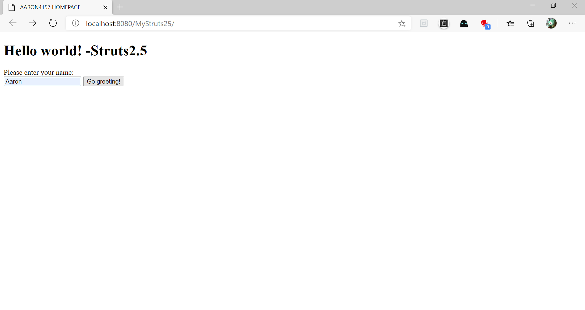
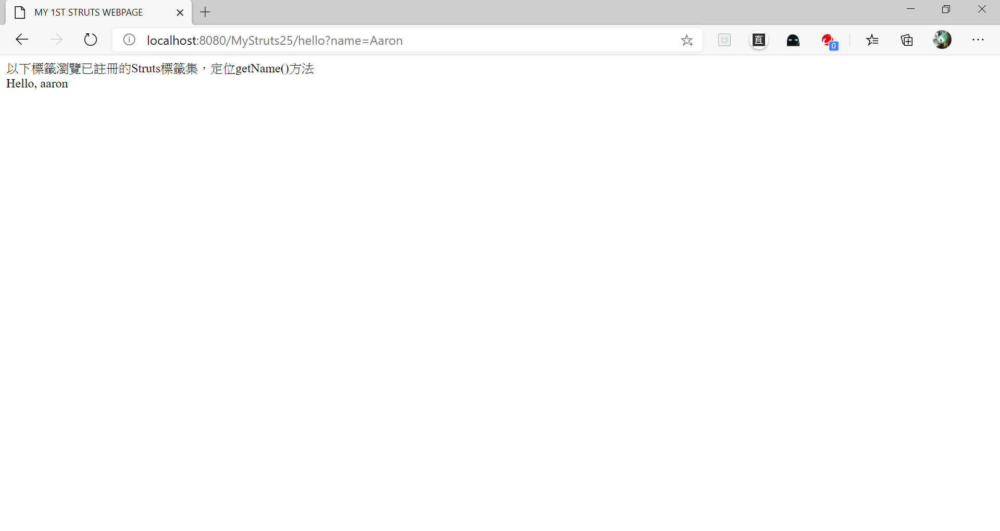

# Strust Introduction
## Strust framework 繼承標準的MVC框架，加以延伸:
* 前端透過struts.xml 呼叫Model進行動作
* Model(細分為domain與action)為POJO類別，負責商業邏輯(BI)處理
* View使用jsp頁面, 由controller調用
* Controller由strust.xml負責聯繫Model與派送View
* 這個框架由DD file註冊的Dispatcher Filter實現
>

## Strust 2.5 改版,導致向前不相容的問題:
* lib重整, WEB-INF/lib/下的.jar只能放特定的13個,不要多放
* strust.xml調整內容. 表頭改為
  `<!DOCTYPE struts PUBLIC
	"-//Apache Software Foundation//DTD Struts Configuration 2.5//EN"
	"http://struts.apache.org/dtds/struts-2.5.dtd">`
* web.xml調整內容, 全域filter改用這個
  `org.apache.struts2.dispatcher.filter.StrutsPrepareAndExecuteFilter`

## 練習網頁的執行結果如圖所示
1. 
1. 

## Actions in Struts
* POJO或 ActionSupport subclasses在 struts.xml註冊
* 或使用org.apache.struts2.convention.annotation 的註解方式註冊
* 所有actions都可以由網址定向(get-able) ex MyAction.java, namespace="/app", name="acc"
* v2.5為與Spring兼容，將網址做分支處理，使用時需要後綴".action"
	* call name="app/acc.action"
	* /app/acc.action
	* /app/my.action
* 沒有註冊的"編外"成員通通返回welcome file

## 資料來源
* [參考資料1](http://tw.gitbook.net/struts_2/struts2_quick_guide.html)
* [參考資料2](https://www.cnblogs.com/rainbow70626/p/10395133.html)
